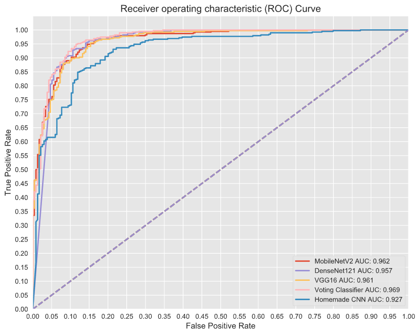
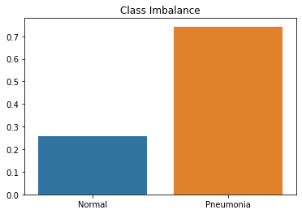
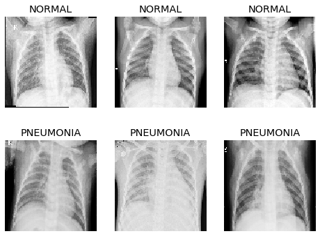
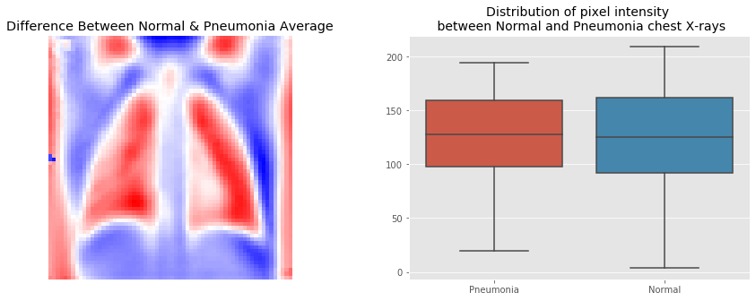
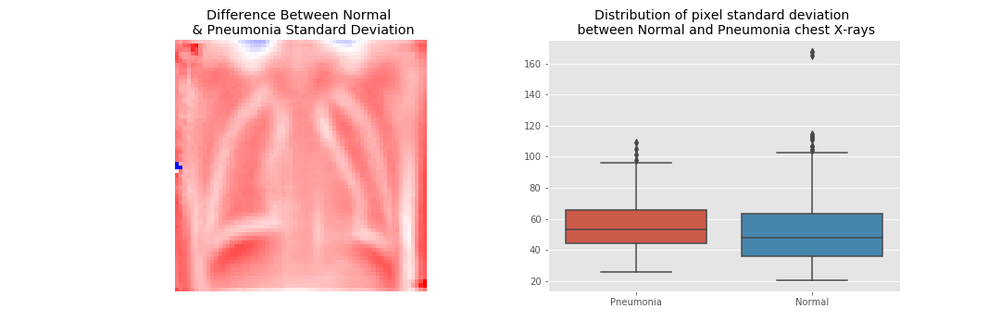
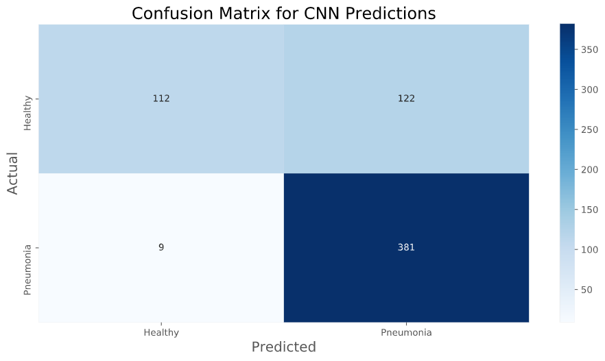
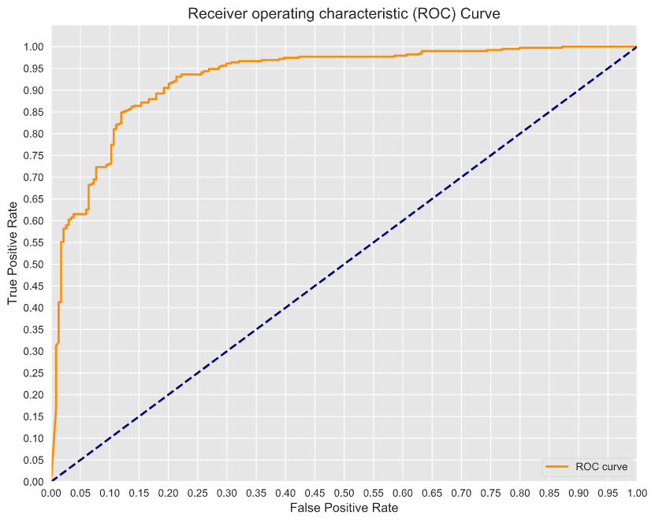
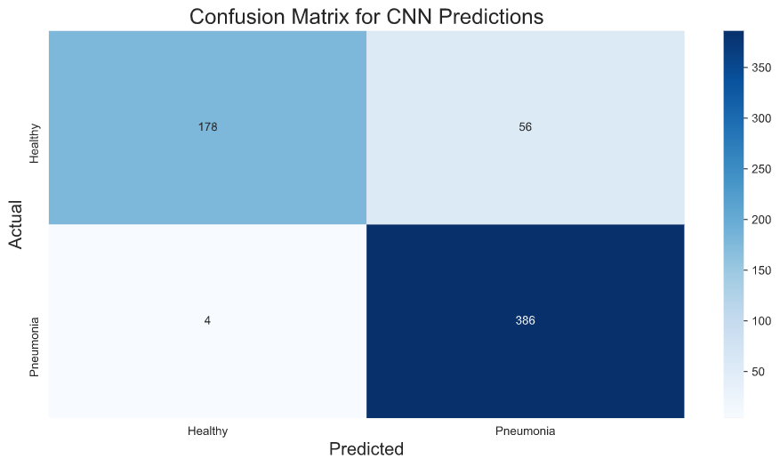

# Identifying Pneumonia From Chest X-ray Images 
### Using ensemble classification and transfer learning to implement pneumonia triage


**Authors**: [Tim Hintz](mailto:tjhintz@gmail.com), [Nick
Subic](mailto:bagnine@gmail.com)


## Overview

We built a light-weight, ensemble, voting-classifier using 3 transfer learning models (VGG16, DenseNet121, MobileNetV2) to predict the presence of pneumonia from x-rays of childrens (age 1-5) chests. Given the use case, we optimised for both recall and accuracy. we optimised recall was to minimise the number of lethal false negtives, but we also wanted to insure that medical professionals weren't being inundated with false positives.

Summary of key findings:
- Accuracy: 0.9038

- Recall: 0.9897

- AUC: 0.9691




## Healthcare Problem

Pneumonia is the leading cause of death among children across the globe. Pneumonia is a respiratory disease of the lungs usually caused by viral or bacterial infections. The World Health Organization estimated that in 2017 pneuomonia killed 800,000 children under the age of five, or 1 in 6 of all deaths of children in that age range. In addition, epidemiologists suggest that of the children that die of pneumonia every year, 45% of those are due to poor living conditions, specifically air quality. Since air quality has been linked to socioeconomic status, the present study built a statistical model using convolutional neural networks in order to aid in the diagnosis of pneumonia. 

X-rays are a widely accessible imaging technique used to diagnose pneumonia but a lot of trianing is required for a medical professional to reliably diagnose the disase. We were able to run our nerual network on a relatively low powered 2018 MacBook Air. We propose that implementing rapid image classification in low income communities could aid medical professionals in better allocating their time and resources.


## Data

Our dataset contains 5,863 X-Ray images, downloaded from Kaggle. The images were taken from pediatric patients from 1 to 5 years old in Guangzhou, China and contain instances of both bacterial and viral pneumonia.

The set is split into three groups-
1. A training set consisting of 5216 images, 3875 with pneumonia and 1341 healthy
2. A test set consisting of 624 images, 390 with pneumonia and 234 healthy
3. A validation set consisting of 16 images, with 8 each with pneumonia and healthy


We addressed class imbalance via image augmentation and weighting each class by their inverse frequency. However, image augmentation did not perform as well as class weighting so we only used class weighting in our final models.





Looking at three examples from each class, the differences are subtle. But we hope that by then end of this section you will be able to accurately identify pneumonia chest x-rays from normal ones. Pay close attention to the definition of the chest cavity in Normal images and the blurred lung area in pneumonia patients




If we compare the mean pixel intensity between the two groups, where a higher value here represents a higher average pixel intensity in pneumonia chest x-rays, we can see that on average, pneumonia images have far brighter lungs. This is due to scarificaton and fluid build up in the lungs due to the infection.




Now that we have developed some intuition where the images are most different from eachother, let's look at how much interclass difference there is. To do this, we looked at the standard deviation for pixel intensity for each class and then, similar to before, we fond the difference between the two and plotted it.




## Methodology

For preprocessing, we resized each image to 224x224 pixels and ran models both after converting them to greyscale and as a 3d tensor array.  We calculated the inverse frequency of each class in our training data to use as class weights in our models. 

We used an Adam classifer which uses an adaptive learning rate with stochastic gradient descent. 

We created a convoluted neural network consisting of 8 alternating convolution and max pooling layers, followed by a flattening layer and 3 densely connected layers interspersed with regularization layers. Using our target metric- Recall- along with Accuracy and AUC we were able to tune our model to avoid over predicting pneumonia while still avoiding a potentially life-threatening false negative. 


### VGG16: Make it AlexNet, but better


image [source](https://neurohive.io/en/popular-networks/vgg16/)


It's impossible for us to talk about image classfication tasks, particularly when it comes to transfer learning, without paying respect to AlexNet. AlexNet was really the first model that took advantage of GPU processing to implement a deep learning task. VGG16 replaced Alexnets enormous central kernel filters with multiple streamlined 3x3 filters (see image). This model is a pain to train even with transfer learning due to it's size (with weights and nodes the model size was  ~500mb). However, VGG16 yeilded amazing results in our use case.


### Densenet121 Architecture, an unconventional take on image classification.


image source: [Hashmi et al., 2020: Efficient Pneumonia Detection in Chest Xray Images Using Deep Transfer Learning](https://www.ncbi.nlm.nih.gov/pmc/articles/PMC7345724/#app1-diagnostics-10-00417)


As we were learning about image classfication, we continuously read that convolutions were king. This made sense. A sliding filter that could pick out features in in the image via [convolutions](https://en.wikipedia.org/wiki/Convolution#Visual_explanation)l. However, we saw [Densenet](https://towardsdatascience.com/understanding-and-visualizing-densenets-7f688092391a), an almost entriely densley connected network, outperform primarily convolutional neural networks. Indeed, in the present study, we found that of the three models we tested, Densenet121 performed the best. In light of the performance, we included in Densenet in our stacked classifier.


### Mobilenet, a light weight multipurpose image recognition architecture


image source: [Hashmi et al., 2020: Efficient Pneumonia Detection in Chest Xray Images Using Deep Transfer Learning](https://www.ncbi.nlm.nih.gov/pmc/articles/PMC7345724/#app1-diagnostics-10-00417)


MobilenetV2 ustilizes [depth-wise convolutions](https://medium.com/@zurister/depth-wise-convolution-and-depth-wise-separable-convolution-37346565d4ec) and linear bottlenecks between convolution blocks to maximise classification on RGB images. We selected this architecture because it had previously been used effectively in this classfication task, it took the same dimensional input as VGG16 and DenseNet121 but also it is very lightweight. Initially being designed to run on mobile devices, we wanted to use a model that, by itself could have accuracy, recall and also run on low powered computers.


## Results

### Homemade CNN

Accuracy: 0.7901

Recall: 0.9769

Auc: 0.8848





Our homemade model had good recall but was far to sensitive. Having 122 false positives would do little to ease congestion of health care workers. The specificty of this model was 0.5. Since computing time was a limiting factor in our project, we set out to utilize pre trained models to improve our accuracy. 

### VGG16

VGG16 was our largest model by far. It took 3x the time to converge. After regularizing the dense connections using dropout, we achieved:

Accuracy: 0.8830

Recall: 0.9897

AUC: 0.9480

### Densenet121

Considering this model was unconventional for image classification we were surprised that it worked so efffectively in our use case:

Accuracy: 0.8734 

Recall: 0.9923

AUC: 0.9044

### MobileNetV2 

Thogh MobileNetV2 was our fastest model to converge by far, it was less effective overall. However, it could be deployed on older, less powerful computers so we were very pleased with the results:

Accuracy: 0.8814

Recall: 0.9795

AUC: 0.9485

### Ensemble Voting Classfier

We wrote our own soft voting classifier. After experimenting with classification thresholds, we optimised the probability threshold to be 0.65 from 0.5 which increased our accuracy to 0.90 from 0.87 and didn't decrease our recall.

Accuracy: 0.9038

Recall: 0.9897

AUC: 0.9691




## Discussion and Conclusions

We are happy with the results of our model given the 1 week time constraint we were under. However, from reading the literature, using an optimiser with an adaptive learning rate does not always give the best results. It does speed up the time to converge, but can also lead get trapped in local minima.

Therefore, if we had more time and access to more powerful computers, we would use stochastic gradient descent with a very low learning rate (alpha ~ 0.0001) with stepped learning decay and run 100 epochs per model.

In addition, we would like to train a multiclassfication model. The positive class has both viral and bacterial pneumonia cases. We understand tht bacterial cases are often more severe. Therefore we would like to indicate whether a particular infection is bacterial or viral. Even if the classifier's accuracy drops, the possibility that false positives could be reduced by more accurately predicting healthy patients versus pneumonia, even if it's the incorrect type of pneumonia, would be an overall improvement.

Finally, here we used wrote a soft voting classifier simililar to the scikit learn implementation. In the future we are interested in building a stacked classifier that uses backpropagation to assign weights to the output of each model in the classifier.

## Repository Structure

```
├── Index.ipynb     | A complete walkthrough of our project, see also index.pdf
├── README.md       |
├── images          | Images used in this README
├── notebooks       
│   ├── EDA         | Exploratory Data Analysis
│   └── modelling   | Model Prototyping 
└── src
    ├── data        | Image Data
    └── modules     | Custom eda, preprocessing and graphing functions
```
