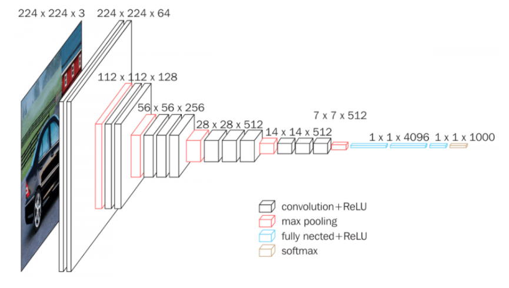
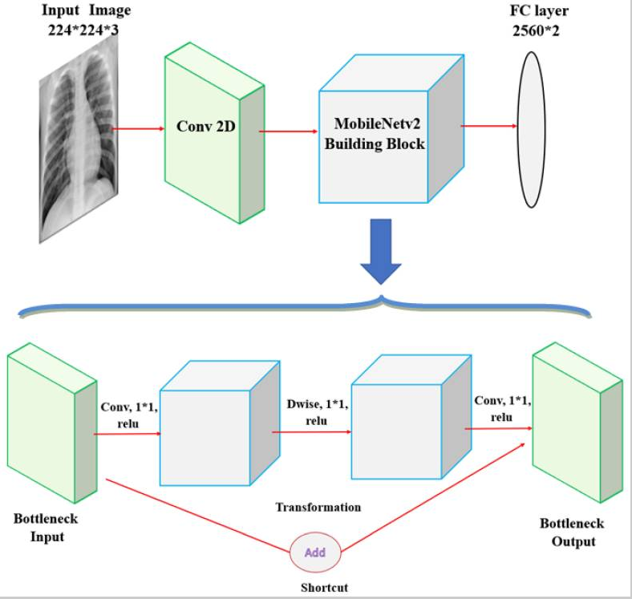

# Title of the Project 
**Authors**: [Tim Hintz](mailto:tjhintz@gmail.com), [Nick
Subic](mailto:bagnine@gmail.com)


## Overview

## Business Problem

As health systems across the United States have become overwhelmed in the past year, the need to streamline and triage medical examinations has become more apparent than ever. Pneumonia remains one of the most frequent causes of death, and diagnosing it quickly can determine whether treatment is successful.

In order to expedite identifying diagnosable signs of pneumonia, we are developing a model which can accurately examine a radiograph for likely areas of lung congestion. Though our model does not offer the in-depth analysis that a radiographer can use in assessing the overall health of a patient or identifying non-pneumonia related health issues, it can quickly assess the presence of bacterial or viral pneumonia from a chest x-ray. 

We hope that this implementation can lead to quicker diagnosis as well as a reduced burden on medical staff as they work to give the best possible treatment to growing numbers of patients. 

## Data

Our dataset contains 5,863 X-Ray images, downloaded from Kaggle. The images were taken from pediatric patients from 1 to 5 years old in Guangzhou, China and contain instances of both bacterial and viral pneumonia.

The set is split into three groups-
1. A training set consisting of 5216 images, 3875 with pneumonia and 1341 healthy
2. A test set consisting of 624 images, 390 with pneumonia and 234 healthy
3. A validation set consisting of 16 images, with 8 each with pneumonia and healthy

## Methodology

For preprocessing, we resized each image to 224x224 pixels and ran models both after converting them to greyscale and as a 3d tensor array.  We calculated the inverse frequency of each class in our training data to use as class weights in our models. 

We created a convoluted neural network consisting of 8 alternating convolution and max pooling layers, followed by a flattening layer and 3 densely connected layers interspersed with regularization layers. Using our target metric- Recall- along with Accuracy and AUC we were able to tune our model to avoid over predicting pneumonia while still avoiding a potentially life-threatening false negative. 

### VGG16: make it Alexnet, but better



image [source](https://neurohive.io/en/popular-networks/vgg16/)


It's impossible for us to talk about image classfication tasks, particularly when it comes to transfer learning, without paying respect to Alexnet. Alexnet was really the first model that took advantage of GPU processing to implement a deep learning task. VGG16 replaces so of Alexnets enormous central kernel filters and replaces them with multiple streamlined 3x3 filters (see image). This model is a pain to train even with transfer learning due to it's size (with weights and nodes ~500mb). But yeilded amazing results in our use case.


### Densenet Archetecture, an unconventional take on image classification.


image source: [Hashmi et al., 2020: Efficient Pneumonia Detection in Chest Xray Images Using Deep Transfer Learning](https://www.ncbi.nlm.nih.gov/pmc/articles/PMC7345724/#app1-diagnostics-10-00417)


As we were learning about image classfication, we continuously read that convolutions were king. This made sense. A sliding filter that could pick out features in in the image via [convolutions](https://en.wikipedia.org/wiki/Convolution#Visual_explanation)l. However, we saw Densenet, an almost entriely connected network, outperform primarily convolutional neural networks. Indeed, in the present study, we found < insert differences between vgg16 and densenet performance here >. In light of the performance, we included in Densenet in our stacked classifier.


### Mobilenet, a light weight multipurpose image recognition archetecture



image source: [Hashmi et al., 2020: Efficient Pneumonia Detection in Chest Xray Images Using Deep Transfer Learning](https://www.ncbi.nlm.nih.gov/pmc/articles/PMC7345724/#app1-diagnostics-10-00417)


MobilenetV2 ustilizes [depth-wise convolutions](https://medium.com/@zurister/depth-wise-convolution-and-depth-wise-separable-convolution-37346565d4ec) and linear bottlenecks between convolution blocks to maximise classification on RGB images. We selected this archetecture because it had previously been used very effectively in this classfication task, it took the same dimensional input as vgg16 and it's archetecture was intrigiung to us. 


For further analysis, we looked at (insert conclusions about false positives, false negatives here- this needs more in depth analysis)


## Results

## Discussion and Conclusions

## Repository Structure

```
├── Index.ipynb
├── README.md
├── images
├── notebooks
│   ├── EDA
│   └── modelling
└── src
    ├── data
    └── modules
```
